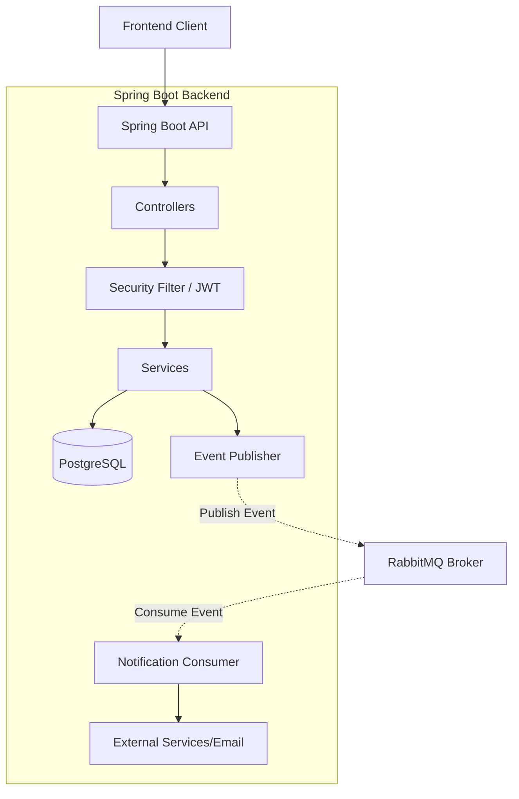

# SportHub Backend


SportHub is a robust and scalable management system for sports technicians, teams, athletes, and training sessions. This backend service is built with Spring Boot, providing a secure, event-driven RESTful API for the frontend application.

## 🏗️ Architecture

The system follows a clean, modular architecture leveraging an event-driven approach for decoupled component communication.



## ✨ Key Features
- **Role-Based Access Control (RBAC):** Granular access control using JWT tokens for Admins, Technicians, and Athletes.
- **Event-Driven Messaging:** Decoupled business flows (e.g., training creation, athlete joining) powered by RabbitMQ.
- **Pagination & Sorting:** Scalable data retrieval for teams and athletes.
- **Automated API Documentation:** Interactive Swagger UI integrated securely.

## 🚀 How to Run

### Prerequisites
- Docker and Docker Compose
- Java 17+ (if running locally without Docker)

### Option 1: Full Docker Environment (Recommended)

1. Copy the environment configuration file:
   ```bash
   cp .env.example .env
   ```
2. Start the entire stack (API, PostgreSQL, RabbitMQ):
   ```bash
   docker-compose up -d --build
   ```
3. The API will be available at `http://localhost:8080`

### Option 2: Local Development (IDE / Maven)

1. Start only the required infrastructure (Database and Message Broker):
   ```bash
   docker-compose up -d postgres rabbitmq
   ```
2. Run the Spring Boot application using Maven:
   ```bash
   ./mvnw spring-boot:run
   ```

## 📚 API Documentation

Once the application is running, you can access the interactive Swagger UI documentation at:
- **Swagger UI:** [http://localhost:8080/swagger-ui.html](http://localhost:8080/swagger-ui.html)
- **OpenAPI JSON:** [http://localhost:8080/v3/api-docs](http://localhost:8080/v3/api-docs)

To test authenticated endpoints in Swagger:
1. Register/Login via the `/auth/login` endpoint to receive a JWT.
2. Click the **Authorize** button at the top of the Swagger UI and enter your token (no `Bearer ` prefix needed, the UI handles it).
